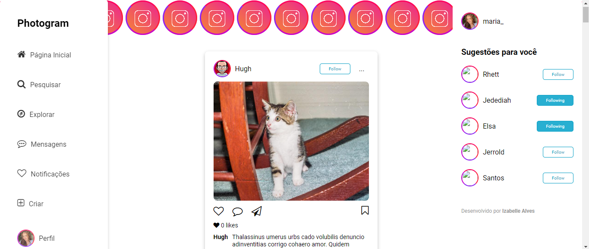
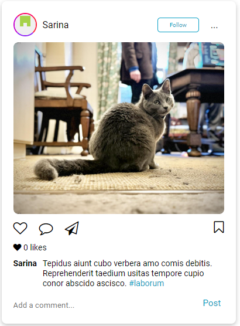
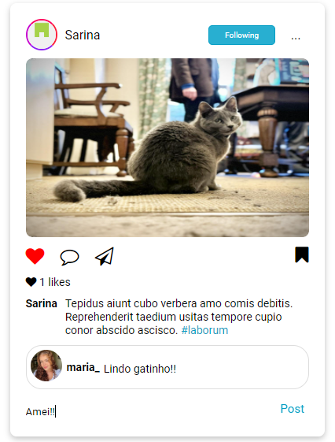
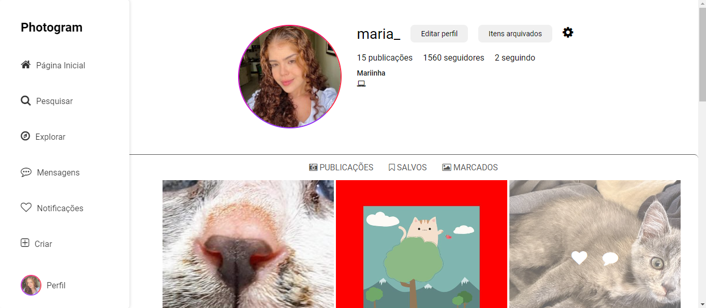
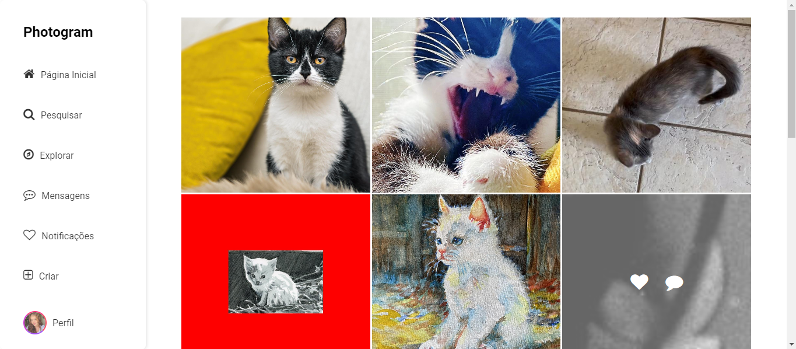

# Photogram

Photogram é um projeto de interface de uma rede social inspirada no Instagram desktop, com foco na interação do usuário e exibição de fotos. A ideia central é simular as telas do Instagram na sua versão web, incluindo os stories, o próprio perfil do usuário, a barra de navegação lateral, área de sugestões de perfis, navegação entre as páginas e funcionalidades de interação como curtidas, comentários e salvar fotos.

## Tecnologias Utilizadas

| **Categoria**                      | **Tecnologias**                                                                                                                                                                                                                                                  |
| ---------------------------------- | ---------------------------------------------------------------------------------------------------------------------------------------------------------------------------------------------------------------------------------------------------------------- |
| **Front-end**                      | - HTML<br>- CSS<br>- TypeScript                                                                                                                                                                                                                                  |
| **Bibliotecas**                    | - @faker-js/faker: Biblioteca para gerar dados fictícios.<br>- UUID: Biblioteca para gerar UUIDs únicos.<br>- @types/uuid: Tipos TypeScript para a biblioteca UUID.<br>- Font Awesome: Biblioteca de ícones.<br>- Google Fonts: Fontes personalizadas do Google. |
| **Ferramentas de Desenvolvimento** | - Vite: Bundler e servidor de desenvolvimento para compilação automática.<br>- TypeScript: Transpilador que converte TypeScript em JavaScript.                                                                                                                   |

## Instalação

<br>Para instalar as dependência do projeto (bibliotecas e dependências de desenvolvimento):

```bash
  npm install
```

## Para rodar o projeto

Como dev:

```bash
  npm run dev
```

## Interfaces

_Tela inicial_


A tela inicial mostra os stories, sugestão de perfis e funcionalidades da sidebar. Todas as publicações são interativas, podendo você curtir, comentar, salvar a publicação e seguir o usuário que fez o post.

_Visualização do post_
| Post 1 | Post 2 |
|-------------------------|-------------------------|
|  | |

_Página do perfil_

Na página no perfil do usuário é possível visualizar o nome do usuário, opções de editar perfil, número de seguidores e outras funcionalidades. A cada vez que o mouse passar em cima da imagem, as funções de curtir e comentar aparecerão.
Desafios e Aprendizados.

A aba explorar, presente na esquerda, apresenta diversos posts.


**_Entre em contato comigo_**

- **E-mail**: [izabelle.alvesbl@gmail.com](mailto:izabelle.alvesbl@gmail.com)
- **LinkedIn**: [Izabelle Alves](https://www.linkedin.com/in/izabellealvess/)
