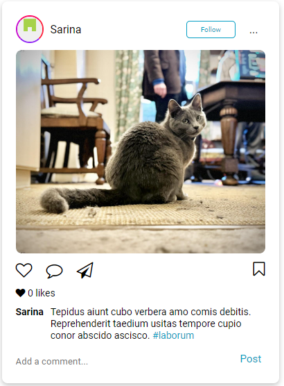
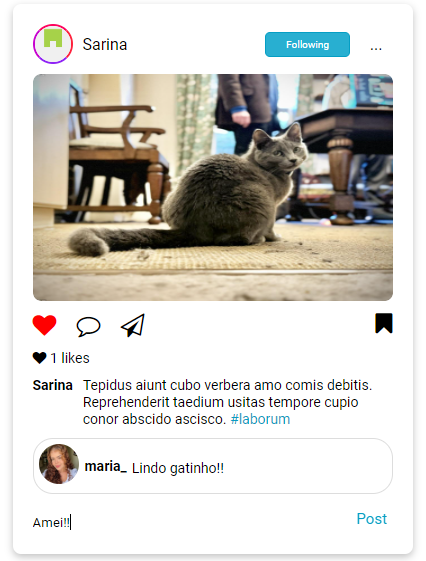

# Photogram

Photogram é um projeto de interface de uma rede social inspirada no Instagram desktop, com foco na interação do usuário e exibição de fotos.

## Visão Geral

A ideia central é simular as telas do Instagram na sua versão web, incluindo os stories, o próprio perfil do usuário, a barra de navegação lateral, área de sugestões de perfis, navegação entre as páginas e funcionalidades de interação como curtidas, comentários e salvar fotos.

## Tecnologias Utilizadas

### Front-end:

- HTML
- CSS
- TypeScript

### Bibliotecas:

- @faker-js/faker: Biblioteca para gerar dados fictícios.
- UUID: Biblioteca para gerar identificadores únicos (UUIDs).
- @types/uuid: Tipos TypeScript para a biblioteca UUID.
- Font Awesome: Biblioteca de ícones.
- Google Fonts: Fontes personalizadas do Google.

### Ferramentas de Desenvolvimento:

- Vite: Bundler e servidor de desenvolvimento para compilação automática.
- TypeScript: Transpilador que converte TypeScript em JavaScript.

## Instalação

Para instalar as dependência do projeto (bibliotecas e dependências de desenvolvimento):

```bash
  npm install
```

## Para rodar o projeto

Como dev:

```bash
  npm run dev
```

## Interfaces

_Tela inicial_

A tela inicial mostra os stories, sugestão de perfis e funcionalidades da sidebar. Todas as publicações são interativas, podendo você curtir, comentar, salvar a publicação e seguir o usuário que fez o post.
 

Desafios e Aprendizados
O desenvolvimento do Photogram foi uma oportunidade incrível de aprendizado, principalmente em relação ao uso de animações CSS e a criação de uma interface parecida com o Instagram. Trabalhar com Vite para a compilação automática também tornou o processo mais ágil e eficiente.

Esse esboço inclui seções detalhadas para descrever as etapas do projeto. Se você já tem imagens das etapas mencionadas, pode adicioná-las ao repositório e atualizar os links no README.
